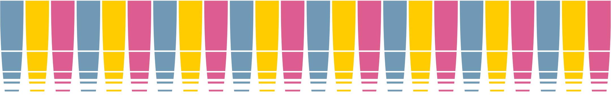

Title: Le Festival
save_as: index.html

> " **Bières Libres & Indépendantes à Bordeaux** "
>
> Le **BLIB** est le 1er festival bordelais dédié à la **bière artisanale**. Créé en 2015, l’association est menée par un collectif regroupant professionnels indépendants et particuliers, amateurs et connaisseurs du monde brassicole.
> Le **BLIB** a su réunir des brasseries artisanales engagées et un public diversifié dans différents lieux de la métropole qui soutiennent la **bière artisanale** : bars, caves, restaurants, brasseries etc. Des dégustations, des rencontres, des ateliers, des conférences.

## La billeterie

Si les préventes sont épuisées des tickets seront en vente sur place au Hangar 14.
La jauge du site étant limitée, il est conseillé d'arriver avant 20h le samedi pour avoir plus de chance d'accéder au festival.

## Les brasseries

## Les partenaires

## Les évènements

# Nous rejoindre

Si tu souhaites rejoindre l’aventure pour contribuer et participer à l’organisation du festival, n’hesite plus une seconde : deviens bénévole !

# Autres informations

Pour toute question, n’hesitez pas à consulter la FAQ ou les infos pratiques.

* [Foire aux questions]({filename}faq.md)
* [infos pratiques]({filename}infos.md)
